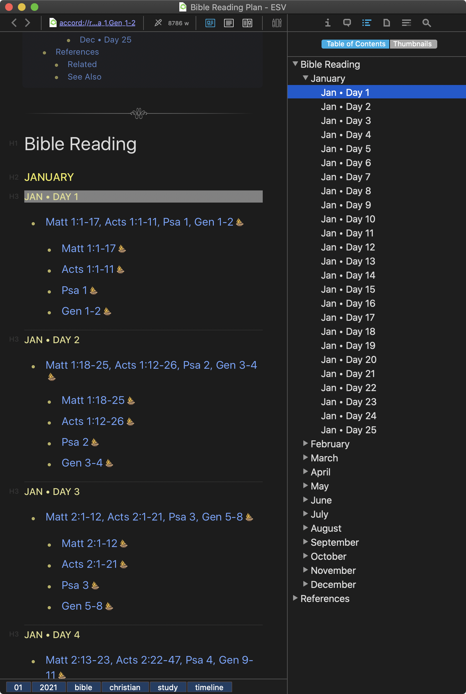
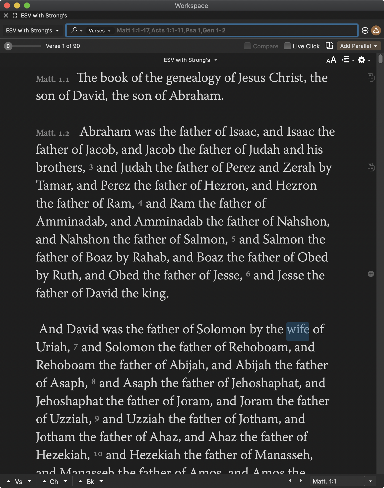
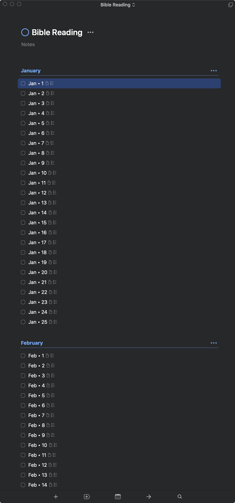
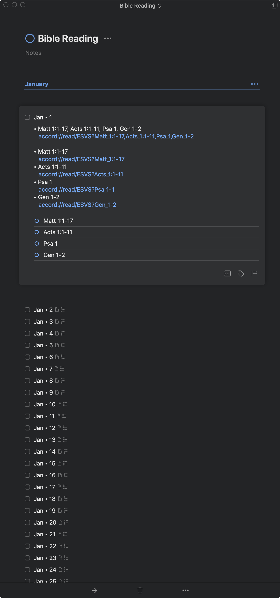

# Discipleship Bible Reading Plan

A small Swift-based utility to generate the [Discipleship Bible Reading Plan](https://www.navigators.org/resource/bible-reading-plans) in a variety of formats *with hyperlinks to passages in [Accordance](https://www.accordancebible.com/)*. Currently supported are:

- Generation of Markdown file/s containing hyperlinks to [Accordance Bible Software](https://www.accordancebible.com/) (on either macOS or Windows)

- Creation of a [Things 3](https://culturedcode.com/things/) project containing todo’s (with checklist for each passage to read) with hyperlinks to the relevant passage/s in Accordance Bible Software.

## Building

```lang-shell
git clone https://github.com/stuartro/DiscipleshipReadingPlan.git
cd DiscipleshipReadingPlan
swift build -c release
cp .build/release/bibleReading  /usr/local/bin
```

## Usage

### Generate a Markdown file
```lang-shell
TRANSLATION=ESVS # Or KJVS, NLT-SE, etc.

/usr/local/bin/bibleReading \
              generateMarkdown \
              --title "Bible Reading" \
              --bible-name-code "$TRANSLATION" \
              --start-month 1 \
              --end-month 12 > readingPlans/discipleShipReadingPlan_ESVS.md
```

#### Pre-generated Markdown files

See [readingPlans](readingPlans/) for a few pre-generated Markdown files. If you are unable to build (e.g. don’t have Xcode, etc.) and want some other translation included, please let me know and I will generate additonal Markdown file/s.

Shown below is the result of pasting the ESVS Markdown file into DEVONthink:

<p align="center">
  
</p>

Of course, any Markdown viewer that supports hyperlinks will do.

Clicking on the hyperlinks opens Accordance to the correct passage. The first hyperlink for each “day” opens all four readings, while clicking the “individual” hyperlinks opens only the particular reading. Shown below is the result of clicking on the “combined / all-4 readings” hyperlink for day 1 in January:

<p align="center">
  
</p>

### Create a Bible-reading project in Things 3
```lang-shell
TRANSLATION=ESVS # Or KJVS, NLT-SE, etc.

/usr/local/bin/bibleReading \
              createThingsProject \
              --project-name "Bible Reading" \
              --bible-name-code "$TRANSLATION" \
              --start-month 1 \
              --end-month 12
```

Running the above command generates a project in Things 3 as shown below:

<p align="center">
  
  
</p>

As with the Markdown files, clicking on the hyperlinks opens Accordance to the correct passage. The first hyperlink for each “day” opens all four readings, while clicking the “individual” hyperlinks opens only the particular reading.

Each task in the generated project contains a checklist for the 4 readings for the particular “day”.
